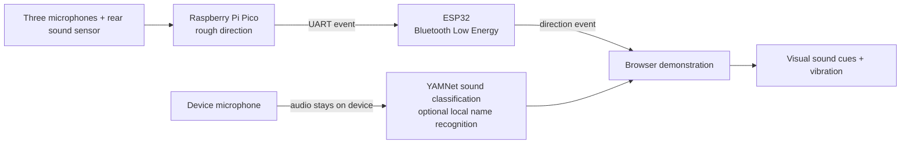

# Synesthesia

**See the sounds around you.**

Synesthesia is a visual sound-awareness prototype for Deaf and hard-of-hearing people. It explores how an AR headset could make nearby sounds easier to notice and understand: a siren appears in the direction it came from, a knock becomes a visible pulse, and someone calling your name becomes a clear alert. The goal is to support awareness and connection with the surrounding world through sight and touch.

The current demonstration runs in a phone browser as a preview of that headset experience. An optional camera view places the cues over a live scene. AR glasses are the intended future display; they are not required to explore the visual design today.

## What the wearer would see

| Sound | Visual cue |
| --- | --- |
| A siren to the right | A red-and-blue wave grows on the right edge of the view. |
| A knock ahead | A short, focused pulse appears toward the front. |
| Someone says the saved name | A prominent name cue appears, with vibration when supported. |
| A possible sound behind | A lower-edge glow warns that the rear sensor fired; its exact direction remains unknown. |

Colors, icons, shapes, and motion distinguish sound categories. When the system recognizes a sound but cannot locate it, the display shows its label without claiming a direction.

## How it works

The Pico reads two MAX4466 modules and one MAX9814 module, with an optional rear LM393 threshold sensor. It calibrates the background sound level, compares microphone activity, and estimates one rough bearing. The ESP32-WROOM-32 forwards that event over Bluetooth. The browser uses its own microphone and a bundled **YAMNet** model through **MediaPipe Tasks Audio** to identify sound types. Where supported, Chrome's on-device speech recognition checks for a name and up to two nicknames entered beforehand. The browser pairs sound types and direction events that occur close together and renders the result as an animated halo.

Only compact direction events travel over Bluetooth. Sound classification runs on the device. The site is static: it needs HTTPS hosting for browser permissions, with no WebSocket connection or live application server.

## Run the demonstration

1. Follow the [Pico setup](hardware/pico/SETUP.md) and [ESP32 setup](hardware/esp32/SETUP.md) to wire, calibrate, and test the sensor rig. Each board uses its own USB power connection; the boards share a ground and a Pico-to-ESP32 UART data wire.
2. Serve the [`web/` folder](web/) from a static HTTPS site. A secure page is required for the phone's microphone and Bluetooth connection.
3. Open the site in Chrome on an Android phone. Save a name if you want name alerts. Power the sensor rig and leave it quiet for five seconds while the Pico measures its background.
4. Tap **Connect**, choose **SynDir**, and allow Bluetooth access. Tap **Start** to enable sound classification. The Name alerts row reports whether local name recognition is available. **Show** enables the optional camera background.
5. With a helper, make one sound at a time from known positions around the rig. Compare the displayed cue with the actual position. Use the rig-front offset in **Sensor setup and diagnostics** if the array and camera face different directions.

The previous Android-only experiment is preserved in Git history and the `audio_classification` branch. The browser uses the same YAMNet model for general sound classification; the Android branch uses a separate sherpa-onnx keyword model for names. [Bundled model and runtime notices](web/vendor/NOTICES.md) are included with the site.

## Current limits

This is a prototype of an AR sound display, not a tested headset or a safety device. Its bearing comes from relative sound levels, so echoes, obstructions, microphone gain, and overlapping sounds can change the result. The rear LM393 provides only a possible-behind hint. A sound type and direction can be paired incorrectly when several sounds happen close together. Name recognition depends on local speech support in the browser; it does not switch to a cloud recognizer.

## Development

The firmware uses MicroPython on the Pico and ESP32. The display is plain HTML, CSS, and JavaScript with Canvas graphics; MediaPipe runs YAMNet locally through WebAssembly. Run `node --test web/web.test.mjs` for the browser logic checks. Hardware fusion checks are in `hardware/tests/`.
